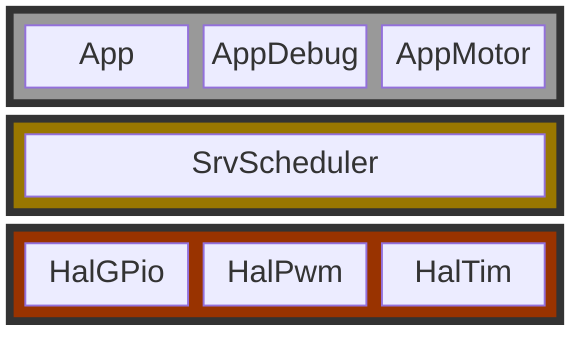
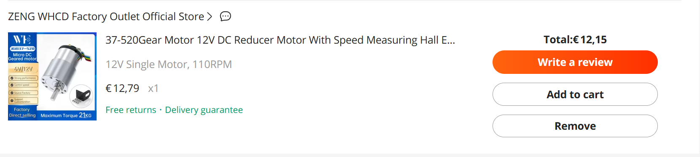
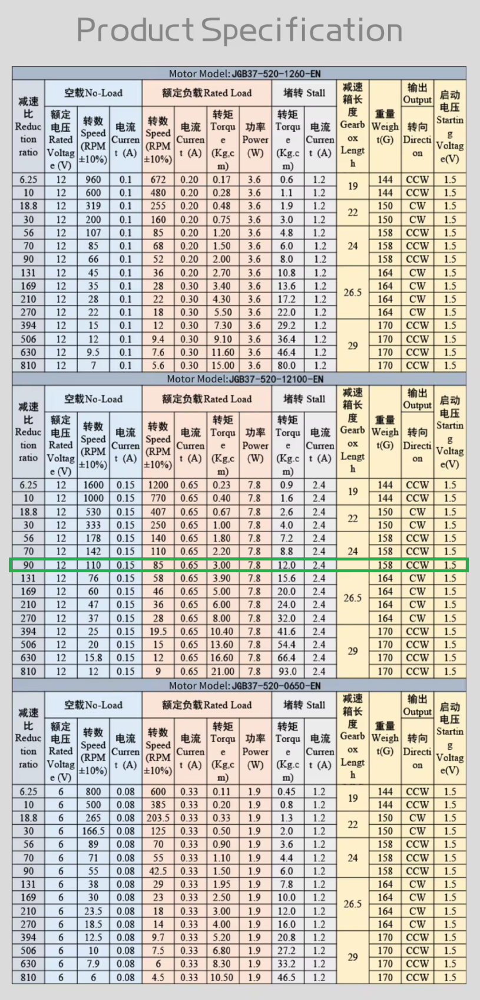
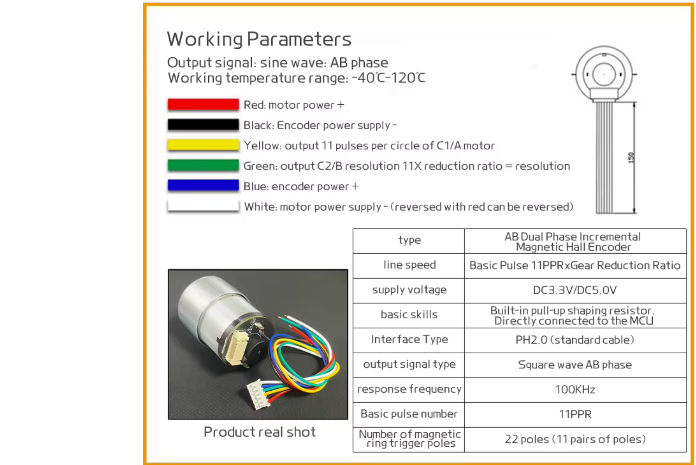

# Layered Architecture


# Pinout


| BTS7960 (Motor Driver)    | nRF5340 Pin                      | Function                           |
|----------------|----------------------------------|------------------------------------|
| RPWM	         | P0.04	                        | Motor PWM (Right)                  |
| LPWM           | P0.05                            | Motor PWM (Left)                   |
| R_EN           | P0.25                            | Enable Right Channel               |
| L_EN           | P0.26                            | Enable Left Channel                |
| R_IS           | NC                               | Not Used (Overcurrent Protection)  |
| L_IS           | NC                               | Not Used (Overcurrent Protection)  |
| VCC	         | 3.3V                             | Logic Power                        |
| GND	         | GND	                            | Ground                             |
| M+	         | Motor Terminal 1	                | Motor Output                       |
| M-	         | Motor Terminal 2	                | Motor Output                       |
| B+	         | Battery Positive (12V or 24V)	| Motor Power                        |
| B-	         | Battery Ground	                | Motor Power                        |

Functionality:

RPWM and LPWM are controlled using PWM signals to adjust speed and direction.
R_EN and L_EN must be set HIGH to enable movement.
BTS7960 provides high-power motor control (supports up to 43A).




| Encoder/Motor Pin	       | nRF5340 Pin	                    |Function                            |
|--------------------------|----------------------------------|------------------------------------|
| 🔵 Encoder PWR+ (Blue)	 | 3.3V	                            | Encoder Power                      |
| ⚫ Encoder PWR- (Black)	 | GND	                            | Ground                             |
| 🔴 MOTOR PWR+   (Red)	   | BTS7960 M+	                    | Motor Terminal 1                   |
| ⚪ MOTOR PWR-   (White)  | BTS7960 M-	                    | Motor Terminal 2                   |
| 🟡 OUT C1/A	   (Yellow)  | P0.23	                        | Quadrature Encoder Signal A        |
| 🟢 OUT C2/B	   (Green)   | P0.24	                        | Quadrature Encoder Signal B        |

Functionality:

OUT C1/A and OUT C2/B provide quadrature signals to track motor position & speed.
These pins are read using interrupts or timers in nRF5340.


# 🧮 Calculating Interrupts per Full Rotation of an Encoder-Based Gear Motor

This document explains how to calculate the total number of **interrupts** (or encoder "counts") you will receive for **one full rotation of the output shaft** of a geared DC motor with a quadrature encoder.

---

## 🧠 Concepts Involved

To calculate the number of encoder interrupts per output shaft revolution, you need to know:

- **PPR (Pulses Per Revolution)** of the **encoder** mounted on the **motor shaft**
- **Gear reduction ratio**
- **Quadrature decoding multiplier**

---

## 📐 Formula

```text
Interrupts per Output Shaft Revolution = PPR × Gear Ratio × Quadrature Multiplier
```


Let's say your encoder motor has:

11 PPR (from the encoder spec)

Gear ratio = 1:30 (gearbox reduces speed by 30×)

You’re using both rising and falling edges of Channel A, so:

Quadrature Multiplier = 2

Interrupts = 11 × 30 × 2 = 660 interrupts per output rotation
